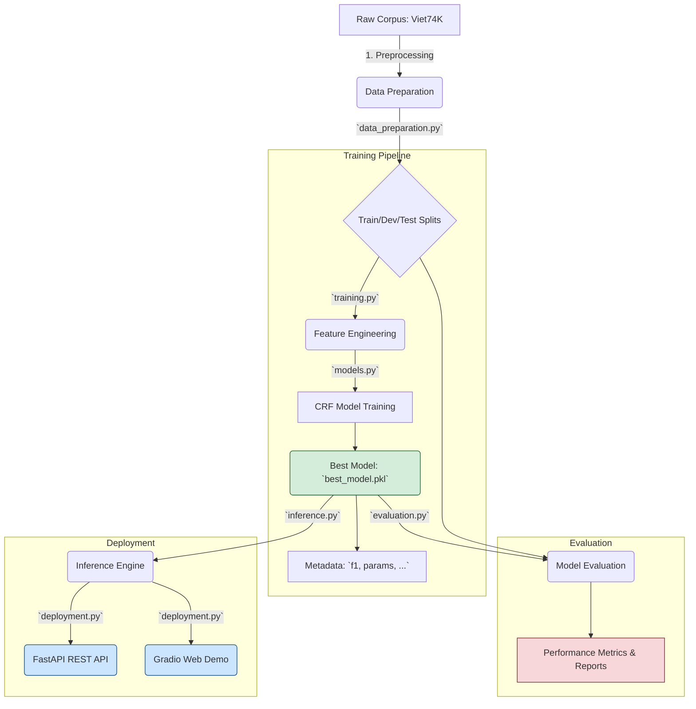

# Comprehensive Vietnamese Word Segmentation with CRF

An end-to-end, production-ready Conditional Random Fields (CRF) solution for Vietnamese word segmentation. This project transforms unsegmented, non-diacritic Vietnamese text into correctly segmented words, complete with a modular architecture for training, evaluation, and deployment via a REST API and an interactive web demo.

## 🌟 Key Features

- **High-Performance CRF Model**: Achieves over 97% F1-score on a large-scale Vietnamese corpus.
- **Advanced Feature Engineering**: Combines character-level n-grams, positional attributes, and dictionary-based features for high accuracy.
- **Multiple Segmentation Suggestions**: The inference engine can provide a ranked list of the N-best segmentation candidates with their confidence scores.
- **End-to-End Pipeline**: Includes scripts for data preparation, model training, comprehensive evaluation, and deployment.
- **Dual Deployment Options**:
  - **FastAPI REST API**: For scalable, production-grade integration.
  - **Gradio Web Interface**: For interactive demos and real-time testing.
- **Scalable Data Handling**: Supports streaming for processing very large corpora that don't fit into memory.

## 🎯 Problem Statement

The core task is to solve a specific challenge in Vietnamese NLP: identifying word boundaries in a continuous string of text that lacks both spaces and diacritics.

- **Input**: `"congnghetuonglailagi"`
- **Output**: `"cong nghe tuong lai la gi"`

This capability is crucial for processing user-generated content, legacy data, or text from systems where proper formatting and diacritics were lost.

## ⚙️ System Architecture

The project is designed with a modular and decoupled architecture, ensuring that each component can be understood, tested, and improved independently.



---

## 🔧 Technical Deep Dive

### 1. Data Preparation (`data_preparation.py`)

The pipeline begins with a raw Vietnamese corpus (`Viet74K_clean.txt`). The `VietnameseDataPreprocessor` class handles the crucial steps:

1.  **Normalization**: The gold-standard text (with spaces and diacritics) is normalized.
2.  **Input Creation (`X_raw`)**: The text is converted to lowercase, diacritics are removed, and all spaces are stripped to create the model's input format.
3.  **Label Preservation (`Y_gold`)**: The original, correctly segmented text is preserved as the ground truth.
4.  **Data Splitting**: The dataset of `(X_raw, Y_gold)` pairs is split into training, development, and test sets. The module supports streaming for handling files too large to fit in memory.

### 2. Feature Engineering & Modeling (`models.py`)

This is the core of the system, where the `CRFSegmenter` and `CRFFeatureExtractor` classes reside.

#### BIES Tagging Scheme

We treat word segmentation as a sequence labeling problem. Each character in the input text is assigned a label from the **BIES** scheme:

- **B**: **B**eginning of a multi-character word
- **I**: **I**nside of a multi-character word
- **E**: **E**nd of a multi-character word
- **S**: **S**ingle-character word

**Example:**

```
Input:  h o c s i n h
Labels: B I E B I E B E
Output: hoc sinh
```

#### Feature Extraction

The model's accuracy heavily relies on a rich set of features extracted for each character at each position `i` in the sequence:

- **Character Identity**: The character `text[i]`, its lowercase form, and its type (digit, alpha).
- **Positional Features**: `BOS` (Beginning of Sequence) and `EOS` (End of Sequence) flags.
- **Contextual N-grams**:
  - Previous and next characters (`text[i-1]`, `text[i+1]`).
  - Bigrams and Trigrams around the current character (e.g., `text[i-1:i+1]`, `text[i:i+3]`).
- **Dictionary-based Features**:
  - A dictionary of known Vietnamese words is built from the training corpus.
  - Features like `dict_match_3` are generated if a substring of length 3 starting at `text[i]` exists in the dictionary. This provides powerful hints about potential word boundaries.

### 3. Training Pipeline (`training.py`)

The `CRFModelTrainer` class orchestrates the training process:

1.  **Load Data**: Loads the train/dev/test splits.
2.  **Build Dictionary**: Constructs the word dictionary from the training set's ground truth (`Y_gold`).
3.  **Instantiate Model**: Creates an instance of `CRFSegmenter`, which uses `sklearn_crfsuite.CRF`.
4.  **Feature Preparation**: Converts the raw text data into feature sequences using the `CRFFeatureExtractor`.
5.  **Train Model**: Trains the CRF model using the L-BFGS optimization algorithm. The model is validated on the development set after training.
6.  **Save Best Model**: The best-performing model (based on F1-score) is saved to `models/crf/best_model.pkl`, along with a `_metadata.json` file containing performance metrics and training parameters.

### 4. Evaluation (`evaluation.py`)

The `CRFEvaluator` provides a robust assessment of the model's performance:

- **Word-level Metrics**: Precision, Recall, and F1-score based on the predicted word boundaries.
- **Sequence-level Metrics**: F1-score calculated from the predicted BIES labels.
- **Accuracy Metrics**:
  - **Sentence Accuracy**: The percentage of input sentences that are segmented perfectly.
  - **Character Accuracy**: The percentage of characters that are correctly classified.
- **Error Analysis**: Identifies and categorizes common error patterns, such as over-segmentation (too many splits) and under-segmentation (missed splits).
- **Reporting**: Generates performance charts and detailed CSV reports.

### 5. Inference & Deployment (`inference.py`, `deployment.py`)

The `CRFInference` class loads the trained model and provides a clean interface for segmentation. A key feature is `segment_multiple`, which uses the model's marginal probabilities to generate a ranked list of the most likely segmentation candidates.

The `deployment.py` script exposes this functionality through two interfaces:

- **Gradio Web Demo**: A user-friendly interface for interactive, real-time segmentation.
- **FastAPI REST API**: Provides production-ready endpoints for integration into other services.

## 📂 Project Structure

```
vietnamese-word-segmentation/
├── src/
│   ├── data_preparation.py    # Data preprocessing and corpus handling
│   ├── models.py             # Feature extraction and CRF model implementation
│   ├── training.py           # Training and validation pipeline
│   ├── inference.py          # Inference engine for single/multiple suggestions
│   ├── evaluation.py         # Comprehensive model evaluation and reporting
│   └── deployment.py         # Gradio and FastAPI deployment
├── data/
│   ├── Viet74K_clean.txt     # Main training corpus
│   ├── train.txt             # Generated training split
│   ├── dev.txt               # Generated development split
│   └── test.txt              # Generated test split
├── models/
│   └── crf/
│       ├── best_model.pkl    # Serialized trained CRF model
│       └── best_model_metadata.json  # Performance metrics and hyperparameters
├── evaluation_results/       # Evaluation outputs (reports, charts)
├── requirements.txt          # Python dependencies
└── README.md
```

## 🚀 Quick Start

### Installation

```bash
# 1. Clone the repository
git clone <repository-url>
cd vietnamese-word-segmentation

# 2. Install dependencies
pip install -r requirements.txt
```

### Training

To train the model from scratch, run:

```bash
python -m src.training
```

This process will:

1.  Load the `Viet74K_clean.txt` corpus.
2.  Create and save `train.txt`, `dev.txt`, and `test.txt` splits in `data/`.
3.  Build a word dictionary from the training data.
4.  Train the CRF model and validate it.
5.  Save the best model and its metadata to `models/crf/`.

### Interactive Demo (Gradio)

To launch the web-based interactive demo:

```bash
python -m src.deployment --mode gradio
```

Access the interface at `http://localhost:7860`.

### REST API (FastAPI)

To run the production-ready REST API:

```bash
python -m src.deployment --mode api
```

The API will be available at `http://localhost:8000`. See the docs at `http://localhost:8000/docs`.

#### API Endpoints

- `POST /segment`: Segments a single piece of text.
  - **Body**: `{ "text": "xinchao", "multiple_suggestions": true, "n_suggestions": 5 }`
- `POST /batch_segment`: Segments a list of texts.
- `GET /model_info`: Returns metadata about the loaded model.

## 🔬 Advanced Usage

The modules are designed for easy extension and custom use.

### Custom Training

```python
from src.training import CRFModelTrainer

# Initialize the trainer
trainer = CRFModelTrainer()

# Run the full pipeline with custom parameters
model, f1_score = trainer.run_training_pipeline(
    train_size=20000,          # Use a subset of the data
    use_dictionary=True,       # Enable dictionary features
    model_output_dir='models/custom_model'
)
print(f"Custom model trained with F1 score: {f1_score:.4f}")
```

### Batch Inference

```python
from src.inference import CRFInference

# Load the trained model
inference_engine = CRFInference('models/crf/best_model.pkl')

texts_to_segment = ["xinchao", "toilasinhvien", "moibandenquannuocvietnam"]

# Get a single best segmentation for each text
results = inference_engine.batch_segment(texts_to_segment)
for res in results:
    print(f"'{res.input_text}' -> '{res.segmented_text}'")

# Get multiple suggestions for a single text
multi_result = inference_engine.segment_multiple("cochangtraivietlencay", n_suggestions=5)
for candidate, confidence in multi_result.candidates:
    print(f"Suggestion: '{candidate}' (Confidence: {confidence:.4f})")
```

### Custom Evaluation

```python
from src.evaluation import CRFEvaluator
from src.models import CRFSegmenter

# Initialize the evaluator and load a model
evaluator = CRFEvaluator()
model = CRFSegmenter()
model.load('models/crf/best_model.pkl')

# Create a sample test set: (unsegmented, ground_truth)
test_data = [
    ("xinchao", "xin chao"),
    ("toilasinhvien", "toi la sinh vien")
]

# Get detailed performance metrics
metrics = evaluator.evaluate_model(model, test_data)
print(f"F1-Score on custom data: {metrics.f1_score:.4f}")
print(f"Sentence Accuracy: {metrics.sentence_accuracy:.4f}")
```

## 🔮 Future Enhancements

- **Hybrid Models**: Integrate this CRF model with a neural network (e.g., BiLSTM-CRF) to potentially capture deeper semantic dependencies.
- **Domain Adaptation**: Fine-tune the model on domain-specific corpora (e.g., legal documents, social media posts) to improve accuracy in specialized contexts.
- **Active Learning**: Implement an active learning loop where the model can query for labels on uncertain predictions, reducing manual annotation effort.

## 🤝 Contributing

Contributions, issues, and feature requests are welcome! For major changes, please open an issue first to discuss what you would like to change.
